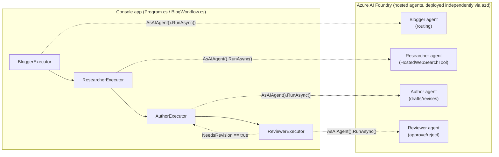

# Architecture

BlogWriter is a Microsoft Agent Framework (MAF) application split into two parts:

1. **Console app** (this repo's root) — orchestrates a bounded revision workflow and never talks to an LLM directly.
2. **Four Azure AI Foundry Hosted Agents** (`HostedAgents/Blogger`, `HostedAgents/Researcher`, `HostedAgents/Author`, `HostedAgents/Reviewer`) — independently deployed, each with its own managed compute and Microsoft Entra ID identity, exposing an OpenAI-compatible `/responses` endpoint.



## Console app: orchestration only

`Program.cs` never builds an agent in-process. For each of the four roles it calls
`AIProjectClient.AsAIAgent(agentEndpoint, ...)`, which returns a MAF `AIAgent` that
talks to the already-deployed hosted agent's `/responses` endpoint. `BlogWorkflow.cs`
wires those four `AIAgent`s into a MAF `WorkflowBuilder` graph
(`Workflows/BlogExecutors.cs` holds the `[MessageHandler]` executors):

```
Blogger → Researcher → Author → Reviewer
                          ↑        |
                          └── (if state.NeedsRevision) ──┘
```

The revision loop is bounded by `ResearchState.MaxRevisions` — the workflow always
terminates, either on reviewer approval or on hitting the revision cap.

**All agent connectivity goes through MAF (`AsAIAgent` / `AIAgent.RunAsync`) — the
console app never issues a raw HTTP call to an agent endpoint.** This is a hard
constraint of this codebase (see `AGENTS.md`), not just a convention.

## Relationship betwen Hosted Agents and Agents
Under `HostedAgents` there is, e.g., `Author` as a project. In the main project there is `AuthorAgent`.

`Author` and `AuthorAgent` are two halves of the same distributed design:

`Author` is the deployable Azure AI Foundry Hosted Agent. Its Program.cs creates an `AIAgent` with the Author instructions and exposes it through the `Responses` protocol. azure.yaml packages and deploys it as the `Author/blogwriter-author service`.

`AuthorAgent.cs` is the local workflow adapter. The main app connects to the hosted agent by name in Program.cs, wraps the remote endpoint as an `AIAgent`, and passes that client into `AuthorAgent`.

During execution, `AuthorAgent` converts `ResearchState` into a prompt, calls the remote hosted agent with _agent.RunAsync(...), then writes the returned draft back into ResearchState. It also owns workflow concerns such as logging, tracing, revision counting, error handling, and fallback drafts.

**They are not the same class and are not directly project-referenced. The hosted project is independently deployable; communication happens over the Foundry Responses endpoint.**

One detail to maintain: the Author instructions are duplicated in Prompts.cs and AgentPrompt.cs. The hosted copy is used at deployment/runtime, while the root copy documents or supports the local architecture, so changes should keep both aligned.

## Authentication

Every hop — console app → hosted agent, and hosted agent → Foundry model/tools — uses
Microsoft Entra ID exclusively (`AzureCliCredential` locally, `DefaultAzureCredential` in
the hosted agents). There are no API keys anywhere in this architecture.

## Session Object
The console now saves each workflow result as JSON under `%LOCALAPPDATA%\BlogWriter\sessions` by default. It prints the `session ID` after each run, accepts follow-up revision requests immediately, and supports resume <session-id> after restarting the app.

## Shared token budget

`TokenCapChatClient.CreateSharedFactory(maxTotalTokens)` produces one `IChatClient`
middleware factory that is passed to every `AsAIAgent(..., clientFactory: ...)` call in
`Program.cs`. All four agents share a single cumulative token counter for the lifetime of
one console-app run (default cap: 40,000 tokens, `MAX_TOTAL_TOKENS`). Exceeding it throws
`TokenCapExceededException`, which unwinds the workflow and exits the app gracefully
instead of continuing to spend tokens.

## Hosted web search (Researcher)

The Researcher hosted agent owns a Foundry-native `HostedWebSearchTool()` — see
`HostedAgents/Researcher/Program.cs`. Web search executes **inside the hosted agent
process**, not in the console app; the console app only sees the final findings text.

## Deployment model

Each `HostedAgents/<Name>` project is deployed independently via `azd` and is
**pre-provisioned** — the console app only references already-deployed hosted agents by
name (`BLOGGER_AGENT_NAME`, `RESEARCHER_AGENT_NAME`, `AUTHOR_AGENT_NAME`,
`REVIEWER_AGENT_NAME`), it never creates or updates them at runtime. See
[deployment.md](deployment.md) for the full `azd` flow and
[configuration.md](configuration.md) for every environment variable involved.

## Known limitation

We're currently seeing more LLM calls than expected during a single workflow run.
It's not yet confirmed whether this is a real extra-call issue or a telemetry
over-count — flagging it here as an open item rather than a resolved one.
