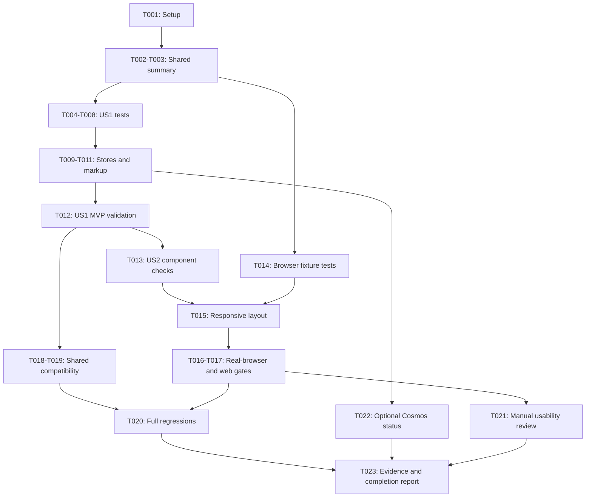

# Tasks: Session List Details

**Input**: Design documents from `specs/016-session-list-details/`.
**Prerequisites**: [plan.md](plan.md), [spec.md](spec.md), [research.md](research.md), [data-model.md](data-model.md), [session-list contract](contracts/session-list.md), and [quickstart.md](quickstart.md).
**Tests**: Required by the specification's acceptance scenarios and measurable outcomes, and by constitution principles for shared state/persistence changes. Write focused checks before changing their owning implementation; verify they fail for the requested behavior, then rerun them after each small edit.
**Organization**: Tasks are grouped by user story. This file describes future implementation; every task starts unchecked.

## Format: `[ID] [P?] [Story] Description`

- `[P]` marks different-file work that can run together after its listed prerequisites are complete; it never bypasses phase gates.
- `[US1]` means Compare Saved Writing Sessions; `[US2]` means Scan and Select Readable Entries.
- Paths are repository-relative. Reuse existing projects and helpers; new test files below own summary, Cosmos, or actual-browser coverage that existing files do not provide.

## Phase 1: Setup (Shared Infrastructure)

**Purpose**: Verify the existing environment, without scaffolding another project or changing dependencies.

- [X] T001 Verify the .NET 10 SDK and current test runner from `BlogWriter.Tests/BlogWriter.Tests.csproj` and `BlogWriter.Web.Tests/BlogWriter.Web.Tests.csproj`, check applicable repository instructions and any ancestor runner configuration, restore the existing test projects, and record baseline command results in `specs/016-session-list-details/quickstart.md`; keep package versions and production configuration unchanged.

## Phase 2: Foundational (Blocking Prerequisites)

**Purpose**: Establish the summary contract shared by both stories and both storage adapters.

- [X] T002 Add focused summary-factory tests in `BlogWriter.Tests/BlogSessionSummaryTests.cs` for four-argument construction/deconstruction, initialized display defaults, additional-property record equality, unchanged original identity/task/timestamps, and no source mutation; cover null/empty/whitespace, 1/49/50/51 words, long drafts, .NET whitespace, punctuation/hyphens, markup, equal positive bounds, zero/negative/reversed pairs, and default-pair fallback from `WordRange.cs`; verify the missing behavior fails before T003.
- [X] T003 Extend `BlogSessionSummary` in `BlogSession.cs` with init-only display properties and a shared side-effect-free summary factory, preserving the four positional fields; implement `MinWords`: "Initialized to existing minimum default; factory supplies effective positive value", `MaxWords`: "Initialized to existing maximum default; factory supplies effective value at least MinWords", `DraftPreview`: "Initialized empty; at most 50 nonempty whitespace-delimited saved draft words, single-space joined", and `IsDraftTruncated`: "Initialized false; true only if a 51st saved draft word exists"; enforce "Valid word-limit pairs have minimum greater than zero and maximum at least minimum. Invalid pairs use `WordRange.Default` as a complete pair, matching restore; do not repair each bound independently." and "Null or whitespace-only draft yields empty preview and false truncation. The UI, not the model, provides \"No draft yet\"."; stop token collection after detecting word 51, keep ellipsis out of the preview, expose no full Draft property, then rerun T002.

**Checkpoint**: The shared summary passes focused tests. No storage schema, method signature, authentication, or agent changes are introduced. Both stories can use enriched in-memory fixtures.

## Phase 3: User Story 1 - Compare Saved Writing Sessions (Priority: P1) - MVP

**Goal**: Pressing List shows each saved session's own effective word limits and exact opening draft excerpt, alongside the existing identifying details.

**Independent Test**: List two or more saved sessions with different bounds/drafts without restoring them; compare every value with saved state, repeat after a saved change, and include 0/50/51-word boundaries. This story does not require the final responsive styling.

### Tests for User Story 1

- [X] T004 [P] [US1] Extend `BlogWriter.Tests/FileBlogSessionStoreTests.cs` to verify saved limits and exact previews, latest saved values on repeated List, missing/partially omitted bound defaults, invalid-pair fallback, null draft, unchanged documents, and the existing newest-first 20-result cap; use controlled legacy JSON fixtures and the shared summary rules from T003.
- [X] T005 [P] [US1] Add credential-free projection/feed tests in `BlogWriter.Tests/CosmosBlogSessionStoreTests.cs` using the existing Cosmos SDK abstraction and repository test-double patterns without a new mocking package; verify selected saved fields, parameterized owner predicate, owner partition, TOP 20, descending update order, all feed pages, cancellation/error propagation, summary equivalence to file listing, and "Missing bounds inherit the existing individual defaults. Equal positive bounds are valid. This applies equally to both serializers' omitted-property behavior."; prove no point reads or writes occur and no draft content is logged.
- [X] T006 [P] [US1] Extend `BlogWriter.Web.Tests/BlogWorkspaceServiceTests.cs` with enriched saved fixtures and repeated-List checks proving each session's latest saved details are shown without borrowing unsaved inputs or another session's content; retain coverage for zero results, existing list failures/cancellation, pending transitions, and disabled commands.
- [X] T007 [P] [US1] Extend rendering checks and the recording fixture in `BlogWriter.Web.Tests/WorkspaceBrowserTests.cs` to assert retained numbers/tasks/update times, "Min words", "Max words", "Draft preview", "No draft yet", literal encoded markup, and "Ellipsis is presentation only, outside preview text and word count. Exactly 50 words never trigger it."; use at least ten distinct summaries for SC-001 and retain existing selection-for-editing checks.
- [X] T008 [P] [US1] Extend `BlogWriter.Tests/BlogWriterSessionServiceTests.cs` to verify enriched summaries pass through unchanged, List performs no additional Get/Save/start/revision calls, cancellation is forwarded, and differences in added record properties are intentionally reflected in fixture assertions.

### Implementation for User Story 1

- [X] T009 [P] [US1] Update `FileBlogSessionStore.cs` to construct enriched summaries through T003 from already-deserialized session state; preserve owner filtering including ownerless local legacy sessions, descending update order, Take(20), timestamps, cancellation, and read-only behavior; rerun T004 immediately (depends on T003 and T004).
- [X] T010 [P] [US1] Update `CosmosBlogSessionStore.cs` by extending only the existing list projection with saved bounds and draft, using a private projection type and T003's shared factory; enforce "Missing bounds initialize individually to `ResearchState` defaults before pairwise validation. Draft text is discarded after factory projection to the public summary."; preserve owner parameter/partition, TOP 20, descending update order, feed disposal/paging, cancellation, logging and errors, with no per-session reads or persisted schema/write changes; consult the Cosmos skill and required Azure guidance before editing, then rerun T005 immediately (depends on T003 and T005).
- [X] T011 [US1] Update `BlogWriter.Web/Components/SessionList.razor` to add distinctly labeled word limits and a labeled literal preview beneath existing identifying information, using T003 properties and "No draft yet"/conditional `...`; use ordinary Razor escaping with no MarkupString, links, nested controls or model calls, preserving numbering, time formatting, accessible identifying name, button callback and disabled state; rerun T007 immediately (depends on T007 and T003).
- [X] T012 [US1] Execute focused summary/store/service/workspace/rendering checks against `BlogWriter.Tests/BlogWriter.Tests.csproj` and `BlogWriter.Web.Tests/BlogWriter.Web.Tests.csproj`, build `BlogWriter.csproj` and `BlogWriter.Web/BlogWriter.Web.csproj`, and record US1 evidence in `specs/016-session-list-details/quickstart.md`, including FR-001 through FR-005, FR-009, SC-001 and SC-002 (depends on T004-T011).

**Checkpoint**: US1 is usable and independently testable with real saved data and baseline row styling. Saved content remains unmodified, and List does not launch work.

## Phase 4: User Story 2 - Scan and Select Readable Entries (Priority: P2)

**Goal**: Expanded entries remain easy to scan on narrow/wide screens and preserve pointer, keyboard and disabled selection behavior.

**Independent Test**: Render controlled enriched summaries with long tasks, large bounds and long unbroken preview words at 320 and 1280 pixels using the actual component and stylesheet; verify hierarchy, bounds, focus and selection without depending on a live store or agent.

### Tests for User Story 2

- [X] T013 [P] [US2] Extend `BlogWriter.Web.Tests/WorkspaceBrowserTests.cs` with component checks for identifying/supporting/preview hierarchy, retained accessible identifying names, pointer selection of duplicate-task entries by their identity, disabled buttons, restored inputs for editing and zero start/revision calls; assert original saved draft/limits remain unchanged (after T007 to avoid same-file conflicts).
- [X] T014 [P] [US2] Add real Chromium checks in `BlogWriter.Web.Tests/SessionListBrowserTests.cs`, reusing `BlogWriter.Web.Tests/ListLauncherTestHelpers.cs` where possible; render the actual SessionList markup and load `BlogWriter.Web/wwwroot/app.css` in a controlled test-only fixture, add only the minimal harness needed, and test 320/1280-pixel row/field bounds, no horizontal overflow or overlap, long words/tasks/large values, visible focus, Tab plus Enter/Space and pointer activation, and disabled prevention; use no live agents or production authentication bypass (depends on T003; integrate T011 markup before final execution).

### Implementation and Validation for User Story 2

- [X] T015 [US2] Extend only session-row styles in `BlogWriter.Web/wwwroot/app.css` with shrinkable content tracks, min-width: 0, wrapping supporting metadata and long-word overflow wrapping; preserve flat divider-separated rows, existing font/color/focus/hover/disabled treatments, and adjust only grouping spans in `BlogWriter.Web/Components/SessionList.razor` if required for hierarchy; run the narrow T013/T014 checks immediately after each edit (depends on T011 and the story's test definitions).
- [X] T016 [US2] Run the T014 browser checks with package-matched Chromium, capture screenshots at both widths and inspect actual text/field geometry, verify pointer and Enter/Space restore the intended selection without saved-state mutation, and record SC-003/SC-004 and FR-006 through FR-008 evidence in `specs/016-session-list-details/quickstart.md`; bUnit viewport declarations alone do not satisfy this task (depends on T014-T015).
- [X] T017 [US2] Rerun focused component/workspace checks for `BlogWriter.Web.Tests/BlogWriter.Web.Tests.csproj`, build `BlogWriter.Web/BlogWriter.Web.csproj`, and reconcile layout/selection results against `specs/016-session-list-details/contracts/session-list.md` without changing its agreed behavior (depends on T013-T016).

**Checkpoint**: Both stories work together. US2 can also be validated with enriched fixtures independently of the storage adapters; no fake service or identity leaks into production.

## Phase 5: Polish & Cross-Cutting Concerns

**Purpose**: Confirm shared compatibility and all acceptance evidence without unrelated cleanup.

- [X] T018 [P] Extend or rerun summary-aware compatibility checks in `BlogWriter.Tests/SessionListFormattingTests.cs` and `BlogWriter.Tests/SessionListSelectionTests.cs` to confirm unchanged console text, numbering, four-field construction/deconstruction and selection behavior despite added summary properties (after US1).
- [X] T019 [P] Extend `BlogWriter.Tests/BlogSessionStoreOwnershipTests.cs` with distinct draft/range content for multiple owners and ownerless local legacy fixtures, proving expanded entries expose only currently authorized sessions and listing cannot write or mutate them (after US1; separate files from T018).
- [X] T020 Run both complete suites via `BlogWriter.Tests/BlogWriter.Tests.csproj` and `BlogWriter.Web.Tests/BlogWriter.Web.Tests.csproj`, then build `BlogWriter.csproj` and `BlogWriter.Web/BlogWriter.Web.csproj`; record pass/fail evidence and any unrelated baseline failures in `specs/016-session-list-details/quickstart.md`, without fixing unrelated defects (depends on T017-T019).
- [ ] T021 Coordinate the manual SC-005 review described in `specs/016-session-list-details/spec.md` with five writers and ten distinguishable sessions, record timing/first-selection results in `specs/016-session-list-details/quickstart.md`, and accept only if at least four writers select correctly within 30 seconds; leave this task unchecked and report the external-validation blocker when participants are unavailable (depends on T016; do not claim automated tests complete it).
- [X] T022 Record in `specs/016-session-list-details/quickstart.md` whether optional real Cosmos/emulator validation was run; if an existing authorized setup is available, repeat saved-detail/legacy/owner checks and record payload/RU observations on long drafts, otherwise explicitly state it was not run; do not provision resources, request secrets, change consistency or alter `CosmosBlogSessionStore.cs` merely to perform this optional check (depends on T010; mock coverage from T005 remains mandatory).
- [X] T023 Reconcile completed implementation and evidence against `specs/016-session-list-details/plan.md`, `specs/016-session-list-details/contracts/session-list.md`, and `specs/016-session-list-details/quickstart.md`, run Markdown diagnostics, verify no authentication/agent/schema/package changes or draft logging were introduced, and mark only genuinely completed tasks in `specs/016-session-list-details/tasks.md`; disclose pending T021 or unavailable optional live validation rather than changing spec-quality checklist markers (depends on automated/browsing gates and T022; T021 must be either completed or explicitly reported pending).

## Dependencies & Execution Order

### Phase Dependencies

- Setup T001 precedes foundational T002-T003.
- T003 blocks both user stories. Story tests may use enriched fixtures after this point.
- Preferred delivery is US1 T004-T012, then US2 T013-T017, then cross-cutting T018-T023.
- US2 is independently testable with enriched fixtures; it does not require live file/Cosmos storage. Integration validation uses US1's markup. T013 waits for T007 because they touch the same file, and T015's markup refinement waits for T011.
- Each implementation task immediately reruns its owning narrow tests. Never parallelize commands that contend for the same build output or browser host.
- T021 is a manual acceptance gate, not an automated coding task. Missing participants prevent claiming full SC-005 acceptance but do not prevent recording other completed work.

### Dependency Graph



### Parallel Opportunities

- T004-T008 define independent US1 checks in five separate files after T003; tests requiring unimplemented behavior should fail for that behavior, not fixture mistakes.
- T009 and T010 update different store files after their respective tests and T003; neither needs the other store's implementation.
- T013 and T014 cover separate component/browser test files after their documented prerequisites. T014 can be prepared with enriched fixtures while US1 adapters are developed.
- T018 and T019 operate on separate compatibility/ownership files after US1. They finish before the full-suite gate.
- No task involving edits to the same file runs concurrently. `[P]` denotes an opportunity, not authorization to delegate or bypass prerequisites.

## Parallel Example: User Story 1

```text
After T003, define in parallel:
T004: FileBlogSessionStoreTests.cs saved projection checks
T005: CosmosBlogSessionStoreTests.cs query/feed checks
T006: BlogWorkspaceServiceTests.cs freshness checks
T007: WorkspaceBrowserTests.cs rendered content checks
T008: BlogWriterSessionServiceTests.cs pass-through checks

After corresponding tests are ready:
T009: FileBlogSessionStore.cs summary mapping
T010: CosmosBlogSessionStore.cs projection mapping
```

## Parallel Example: User Story 2

```text
After T003 and T007, define in separate files:
T013: WorkspaceBrowserTests.cs selection and hierarchy checks
T014: SessionListBrowserTests.cs actual-browser geometry and keyboard checks

Then implement T015 and execute T016-T017; do not overlap edits
to SessionList.razor with T011 or run shared-output builds concurrently.
```

## Requirement Coverage

| Requirement or Outcome | Primary Tasks |
| ---------------------- | ------------- |
| FR-001 saved list identity, order, visibility, empty state | T004-T007, T009-T012, T019 |
| FR-002 effective word limits and legacy defaults | T002-T005, T009-T012 |
| FR-003 exact first 50 whitespace-delimited words | T002-T005, T007, T009-T012 |
| FR-004 empty draft and truncation indicator | T002-T005, T007, T011-T012 |
| FR-005 current saved data, no workspace substitution | T004-T006, T009-T012 |
| FR-006 grouped identifying/supporting/preview hierarchy | T011, T013-T017 |
| FR-007 responsive wrapping and no overlap/overflow | T014-T017 |
| FR-008 pointer, keyboard, disabled state and immutability | T006-T008, T013-T017, T019 |
| FR-009 safe literal rendering | T002, T007, T011-T012, T014 |
| SC-001 ten accurate entries and SC-002 preview boundaries | T002-T007, T012 |
| SC-003 rendered layout and SC-004 selection behavior | T013-T017 |
| SC-005 five-writer timed identification | T021 |

## Implementation Strategy

### MVP First (User Story 1)

1. Complete T001-T003 without changing infrastructure or persisted documents.
2. Complete US1, rerunning focused tests after each storage/component edit.
3. Stop at T012 and validate the saved-detail comparison flow independently. This is the MVP; it does not claim responsive-layout or manual-usability acceptance yet.

### Incremental Delivery

1. Deliver accurate saved previews and word limits through existing summaries and list behavior.
2. Add US2 layout and real-browser validation, retaining existing native selection semantics.
3. Complete compatibility, full-suite and evidence gates; conduct or explicitly report pending manual usability acceptance.

## Notes

- No new project, endpoint, schema migration, persisted preview, caching layer, model call, package upgrade, production test identity, branch creation or deployment is required.
- Apply required Cosmos/Azure tooling before storage changes; apply repository MAF procedures if an implementation unexpectedly requires a MAF change rather than expanding that scope silently.
- Preserve user changes. Do not commit or create branches unless explicitly requested.
- Spec-quality checklist completion describes requirement quality, not implementation progress; do not toggle those markers to claim implementation acceptance.

## Phase 6: Convergence

- [X] T024 Add a real interactive-workspace Chromium test in `BlogWriter.Web.Tests/SessionListBrowserTests.cs` using an isolated live Blazor test host and controlled recording session service; press List, select distinct saved sessions with pointer, Tab/Enter and Tab/Space at 320 and 1280 pixels, assert the loaded session ID and restored prompt/word-limit inputs, verify zero start/revision calls and unchanged saved draft/limits, and verify a genuinely disabled selection state prevents loading; retain static-markup geometry tests but do not treat `window.sessionSelections` synthetic click counts as restoration evidence, keep any host/identity test-only without changing production authorization, and record the focused test command/results in `specs/016-session-list-details/quickstart.md` per FR-008, US2/AC3, US2/AC4, SC-004, plan: Phase 1 browser validation, and T016 (partial).
- [X] T025 Extend `BlogWriter.Web.Tests/WorkspaceBrowserTests.cs` with a Home/List-button integration fixture backed by at least ten saved sessions with distinct ranges and drafts; invoke the actual List command and assert every returned entry's number, task, update time, MinWords, MaxWords and exact preview against independent saved-content expectations rather than factory-generated expected values; include empty, 49-, 50- and 51-word drafts, assert ellipsis only after omitted words, then change one saved draft/range and press List again to verify fresh isolated values, reusing existing recording helpers and recording focused validation in `specs/016-session-list-details/quickstart.md` per SC-001, FR-001, FR-003, FR-004, FR-005, US1/AC1, US1/AC4, and T007 (partial).
